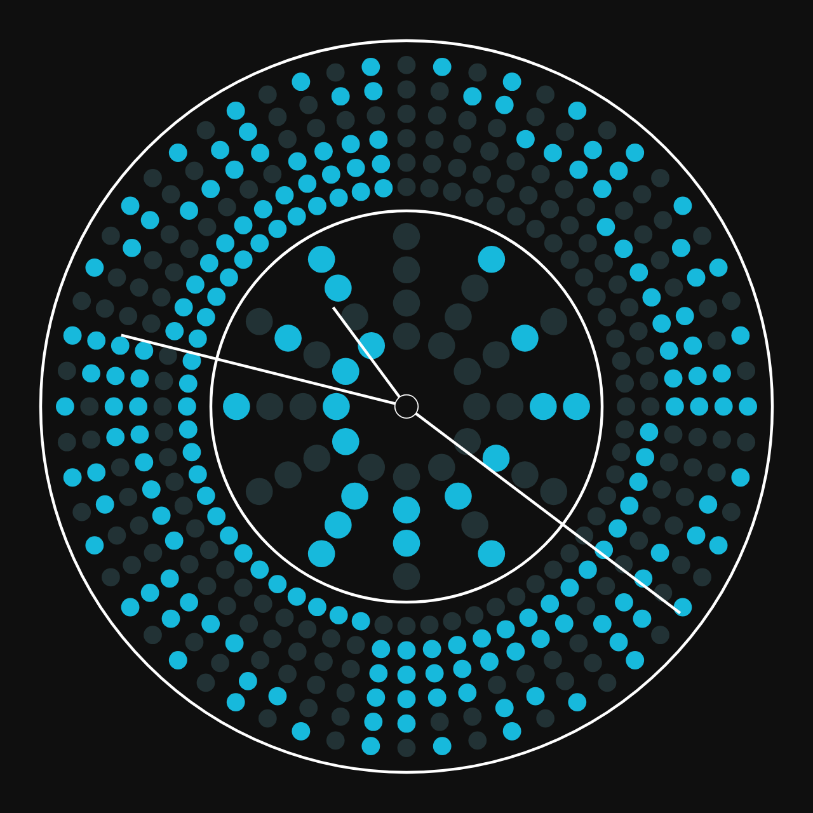

# Analog Binary Clock

This project is a visually attractive analog binary clock implemented using HTML5, CSS, and JavaScript. It displays an animated clock face along with the clock's hands to represent time in an aesthetically pleasing manner. The clock is built using canvas elements, where one canvas represents the clock face with binary patterns, and the other represents the moving clock hands.

## Features
- **Analog Binary Clock Face**: The clock face is represented with alternating colours in a binary pattern to display hour and minute segments.
- **Smooth Clock Hands Animation**: The clock hands move smoothly to indicate seconds, minutes, and hours, providing a continuous and visually dynamic experience.
- **Responsive Design**: The clock resizes dynamically to fit the window dimensions, ensuring a proper display on any screen size.

## Files
- **index.html**: Contains the structure of the webpage, including the canvas elements for the clock face and hands, and references to the CSS and JavaScript files.
- **style.css**: Manages the layout and positioning of the canvas elements, ensuring the proper display of the analogue clock.
- **script.js**: Implements the logic for drawing the binary clock face and moving clock hands and handles the window resize event to keep the clock responsive.

## Technologies Used
- **HTML5**: To provide the structure of the webpage and canvas elements.
- **CSS3**: To style the webpage, manage the layout, and ensure the responsiveness of the clock.
- **JavaScript**: To create and animate the clock face and hands dynamically using canvas elements.

## Screenshot

## License
This project is open-source and available under the MIT License.
